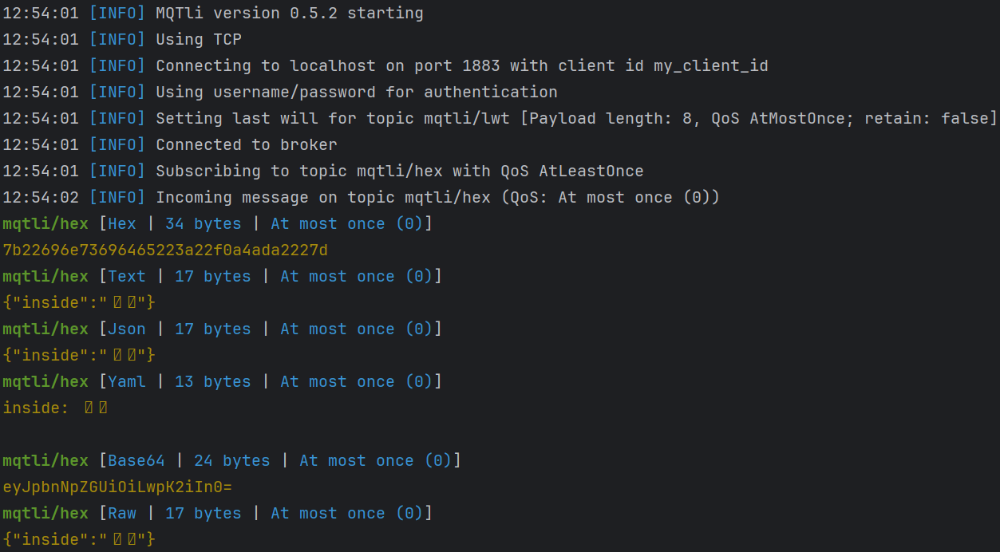

MQTli — A flexible, multi‑topic MQTT CLI client
================================================

MQTli is a multi‑topic, payload‑converting MQTT command‑line client written in Rust. It lets you publish and subscribe to multiple topics at once, and seamlessly convert payloads between formats (e.g., JSON ⇄ Protobuf, YAML, HEX, Base64, UTF‑8, raw) on input and output. It aims to be a single, scriptable Swiss‑army knife for interacting with MQTT 3.1.1 and MQTT 5 brokers.

Screenshot
----------

Key features
------------
- Subscribe to topics and output messages to console, file, SQL database, or another topic.
- Publish messages using triggers (periodic, on incoming topics, etc.).
- Powerful message filters before publish and after receive (chainable):
  - Extract values from JSON using JSONPath (e.g., $.measurements.temp)
  - Convert text to UPPER/lower case
  - Prepend or append text
  - Convert format within a chain (to_text, to_json)
- Eclipse Sparkplug support (Sparkplug B; topic and payload helpers).
- Seamless payload conversion between input, payload, and output formats:
  - json, yaml, protobuf, sparkplug, hex, base64, utf‑8, raw.
- Flexible configuration via CLI arguments, environment variables, and YAML config file.
- MQTT v5 and v3.1.1 support.
- TLS (v1.2, v1.3) and WebSocket (plain and TLS) support.
- Client authentication with username/password or client certificates.
- Last Will, QoS 0/1/2.

Tip: See Quickstart for a short filters example.

Getting started
---------------
Pick one of the options below to try MQTli quickly. For a step-by-step walkthrough, see the Quickstart guide: [docs/quickstart](./quickstart.md).

Option A — Download a prebuilt binary
- Go to the Releases page: https://github.com/kaans/mqtli/releases/latest
- Download the asset for your OS, extract if needed, then run:
  - Windows (PowerShell): `./mqtli.exe --help`
  - Linux/macOS: `./mqtli --help`

Option B — Build from source with Cargo
- Prerequisite: Rust toolchain installed (https://rustup.rs)
- Build and run:
  - `cargo run --release --bin mqtli -- --help`
- Or build a release binary:
  - `cargo build --release`
  - The binary will be at `target/release/mqtli[.exe]`.

Basic usage examples
- Subscribe to a topic and print messages as JSON:
  - `mqtli --host localhost --port 1883 --subscribe 'sensors/+/data' --output-format json`
- Publish a JSON payload to a topic:
  - `mqtli --host localhost --port 1883 --publish 'devices/1/cmd' --input-format json --message '{"cmd":"ping"}'`
- Use TLS (example):
  - `mqtli --host broker.example.com --port 8883 --use-tls true --ca-file ca.pem`

Configuration
-------------
You can configure MQTli via CLI arguments, environment variables, and a YAML config file. If a setting is not supplied, defaults apply. Complex topic configurations are best managed in the config file.

See Operating Modes to choose how MQTli runs in this session: [docs/modes](./modes.md).

Quick start with a config file
1) Copy `config.default.yaml` from the repository to your working directory and rename it to `config.yaml`.
2) Adjust broker, topics, and payload formats to your needs.
3) Run: `mqtli` (or specify a custom file with `mqtli --config-file config.yaml`).

For a full list of CLI arguments and environment variables, run `mqtli --help` or see the project README.

License
-------
This project is licensed under the Apache License 2.0. See the full text in the repository at: [LICENSE.md](../LICENSE.md)

Links
-----
- Source code and releases: https://github.com/kaans/mqtli
- Default configuration reference: [config.default.yaml](../config.default.yaml)
- Example configuration: [config.example.yaml](../config.example.yaml)
